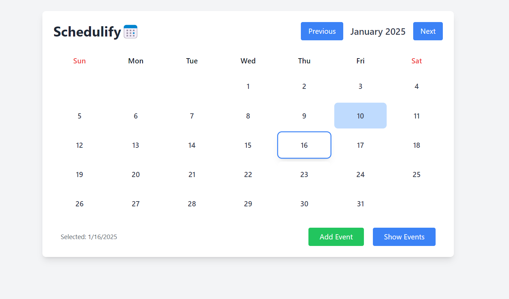
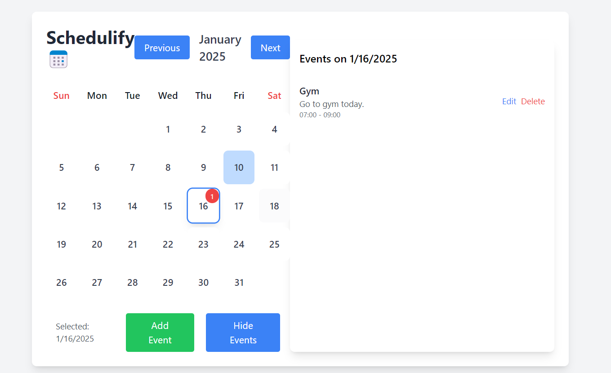

# Schedulify

Schedulify is a powerful and intuitive calendar app designed to help you manage your time effectively. Whether you're planning your day, organizing events, or scheduling tasks, Schedulify provides a seamless user experience to keep you on track.

---

## Features

- **Event Creation**: Easily add, edit, and delete events.
- **Task Management**: Manage your daily, weekly, and monthly tasks effortlessly.
- **Responsive Design**: Optimized for both desktop and mobile devices.

---

## Installation

1. Clone the repository:
   ```bash
   git clone https://github.com/Shubham-Bhatiaa/Schedulify.git
   ```

2. Navigate to the project directory:
   ```bash
   cd Schedulify
   ```

3. Install dependencies:
   ```bash
   npm install
   ```

4. Start the development server:
   ```bash
   npm start
   ```

---

## Usage

1. Go to the active URL where your app is running.
2. Start adding events and tasks to organize your schedule.

---

## Screenshots

### Home Page


### Add Event


### Calendar View


---


## Contributing

Contributions are welcome! Follow these steps to contribute:

1. Fork the repository.
2. Create a new branch:
   ```bash
   git checkout -b feature-name
   ```
3. Commit your changes:
   ```bash
   git commit -m "Add your message"
   ```
4. Push to the branch:
   ```bash
   git push origin feature-name
   ```
5. Create a pull request.

---


## Contact

For any questions or feedback, feel free to reach out:

- **Name**: Shubham Bhatia
- **Email**: [Shubhambhatia534@mgmail.com](mailto:shubhambhatia534@gmail.com)
- **GitHub**: [Shubham-Bhatiaa](https://github.com/Shubham-Bhatiaa)

---

Enjoy using Schedulify! Stay organized and productive!
